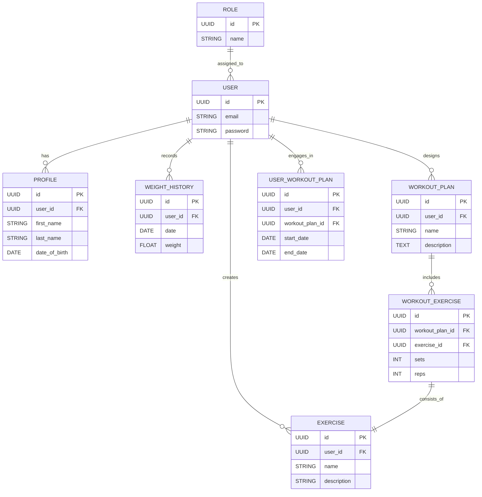

# 🏋️‍♂️ Fitness Tracker

Una aplicació de seguiment de fitness full-stack desenvolupada amb Angular i Supabase.

## Índex

1. [⚙️ Configuració del Backend](#configuració-del-backend)  
   1.1. [Prerequisits](#prerequisits)  
   1.2. [Variables d'Entorn](#variables-dentorn)  
   1.3. [Instal·lació i Execució](#instal·lació-i-execució)  

2. [📁 Estructura del Projecte](#estructura-del-projecte)  

3. [🗄️ Base de Dades](#base-de-dades)  
   3.1. [Diagrama Entitat-Relació](#diagrama-entitat-relació)  

4. [🔐 Autenticació](#autenticació)  
   4.1. [Característiques](#característiques)  

5. [🔌 API Endpoints](#api-endpoints)  
   5.1. [Autenticació](#autenticació-1)  
   - [Registre](#registre)  
   - [Inici de Sessió](#inici-de-sessió)  

6. [⚠️ Gestió d'Errors](#gestió-derrors)  
   6.1. [Codis HTTP](#codis-http)  
   6.2. [Format de Resposta d'Error](#format-de-resposta-derror)  
   6.3. [Codis d'Error Comuns](#codis-derror-comuns)

## ⚙️ Configuració del Backend

### Prerequisits
- Node.js >= 18
- npm >= 9
- Compte a Supabase

### Variables d'Entorn

Crea un fitxer `.env` amb les següents variables:

```env
VITE_SUPABASE_URL=https://erngjtqjcjocxraztabj.supabase.co
VITE_SUPABASE_ANON_KEY=eyJhbGciOiJIUzI1NiIsInR5cCI6IkpXVCJ9...
```

### Instal·lació i Execució

```bash
# Instal·lar dependències
npm install

# Iniciar servidor de desenvolupament
npm start   # Port per defecte: 4200
```

## 📁 Estructura del Projecte

```
src/
├── app/
│ ├── components/ # Components compartits
│ ├── models/ # Interfícies i classes TypeScript
│ ├── pages/ # Components de pàgina
│ ├── services/ # Serveis per a la gestió de dades
│ └── shared/ # Utilitats i interfícies compartides
├── environments/ # Configuració d'entorns
└── supabase/
└── migrations/ # Migracions de base de dades
```


## 🗄️ Base de Dades

### Diagrama Entitat-Relació



## 🔐 Autenticació

### Característiques
- ✉️ Autenticació amb correu electrònic/contrasenya
- 🔄 Gestió de sessions
- 👥 Control d'accés basat en rols (Usuaris/Admins)
- 🛡️ Polítiques de Seguretat a Nivell de Fila (RLS)

## 🔌 API Endpoints

### 🔑 Autenticació

#### Registre
```http
POST /auth/sign-up
```

**Request:**
```json
{
  "email": "user@example.com",
  "password": "securepassword"
}
```

**Response (200 OK):**
```json
{
  "user": {
    "id": "uuid",
    "email": "user@example.com"
  },
  "session": {
    "access_token": "token",
    "refresh_token": "token"
  }
}
```

#### Inici de Sessió
```http
POST /auth/sign-in
```

**Request:**
```json
{
  "email": "user@example.com",
  "password": "securepassword"
}
```

**Response (200 OK):**
```json
{
  "user": {
    "id": "uuid",
    "email": "user@example.com"
  },
  "session": {
    "access_token": "token",
    "refresh_token": "token"
  }
}
```

## ⚠️ Gestió d'Errors

### Codis HTTP

| Codi | Descripció | Exemple |
|------|------------|---------|
| 400 | Bad Request | Dades d'entrada no vàlides |
| 401 | Unauthorized | Autenticació invàlida |
| 403 | Forbidden | Permisos insuficients |
| 404 | Not Found | Recurs no trobat |
| 409 | Conflict | Recurs ja existent |
| 500 | Server Error | Error intern |

### Format de Resposta d'Error
```json
{
  "code": "ERROR_CODE",
  "message": "Missatge d'error comprensible",
  "details": {}
}
```

### Codis d'Error Comuns

| Codi | Descripció |
|------|------------|
| `INVALID_CREDENTIALS` | Credencials incorrectes |
| `USER_EXISTS` | Usuari ja registrat |
| `INVALID_INPUT` | Dades invàlides |
| `NOT_FOUND` | Recurs no trobat |
| `UNAUTHORIZED` | No autenticat |
| `FORBIDDEN` | No autoritzat |
| `SERVER_ERROR` | Error intern |

---
