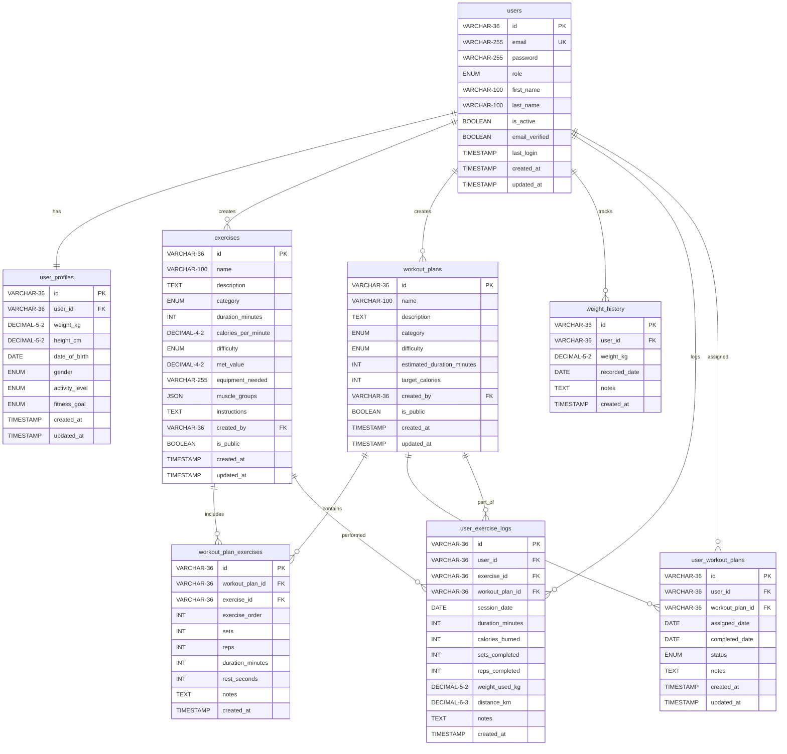

# 🏋️ Fitness Tracker API

A comprehensive REST API for fitness tracking built with Express.js, MySQL, and modern web technologies. This project demonstrates professional-level backend development skills and modern API design patterns.

**🚀 Production Ready** | **📊 Comprehensive Sample Data** | **🔒 Secure & Scalable**

---

## 🎯 QUICK START GUIDE

### ⚡ One-Command Setup (Recommended)

```bash
# Clone and setup everything automatically
git clone https://github.com/NFTim-og/FitnessTrackerAngular.git
cd FitnessTrackerAngular/backend
npm install
npm run docker:init
npm run seed
npm start
```

**✅ That's it! Your API is now running with complete sample data at `http://localhost:3000`**

### 🔑 Default Login Credentials

| Role | Email | Password | Purpose |
|------|-------|----------|---------|
| **Admin** | `admin@example.com` | `admin123` | Full system access, user management |
| **User** | `user@example.com` | `user123` | Regular user with workout data |
| **User** | `jane.smith@example.com` | `user123` | Strength training focused |
| **User** | `mike.wilson@example.com` | `user123` | Sports performance data |
| **User** | `sarah.johnson@example.com` | `user123` | Endurance training data |

### 📋 Essential URLs for Evaluation

| Resource | URL | Description |
|----------|-----|-------------|
| **API Root** | `http://localhost:3000` | HTML presentation page |
| **API Documentation** | `http://localhost:3000/api-docs` | Interactive Swagger UI |
| **Health Check** | `http://localhost:3000/health` | System status |
| **Database Admin** | `http://localhost:8080` | phpMyAdmin (admin/admin123) |

### 🧪 Quick API Test

```bash
# Test authentication
curl -X POST http://localhost:3000/api/v1/auth/login \
  -H "Content-Type: application/json" \
  -d '{"email":"user@example.com","password":"user123"}'

# Test protected endpoint (use token from login)
curl -X GET http://localhost:3000/api/v1/exercises \
  -H "Authorization: Bearer YOUR_TOKEN_HERE"
```

### 📊 Sample Data Overview

The database is automatically populated with:
- **5 Users** with varied profiles and fitness goals
- **20 Exercises** across all categories (cardio, strength, flexibility, balance, sports)
- **8 Workout Plans** with different difficulty levels and purposes
- **30+ Weight History** entries showing user progress
- **15+ Exercise Logs** demonstrating user activity
- **Complex Relationships** showcasing many-to-many database design

### 🎓 Curriculum Compliance Verification

| Requirement | Status | Evidence |
|-------------|--------|----------|
| **ES Modules** | ✅ | `"type": "module"` in package.json |
| **API Versioning** | ✅ | All routes use `/api/v1` prefix |
| **CRUD Operations** | ✅ | GET, POST, PUT, DELETE for all resources |
| **JWT Authentication** | ✅ | Token-based auth with role-based access |
| **Input Validation** | ✅ | express-validator with comprehensive schemas |
| **Rate Limiting** | ✅ | Multiple rate limiters for different endpoints |
| **Many-to-Many Relationships** | ✅ | `workout_plan_exercises`, `user_workout_plans` |
| **UUIDs** | ✅ | All tables use UUID primary keys |
| **SQL Injection Prevention** | ✅ | Parameterized queries throughout |
| **Error Handling** | ✅ | Centralized error middleware |
| **Pagination & Sorting** | ✅ | Advanced pagination with metadata |
| **HTML Presentation** | ✅ | Professional landing page at root URL |

---

## 📋 Table of Contents

- [Project Overview](#project-overview)
- [Technical Requirements](#technical-requirements)
- [Features](#features)
- [Technology Stack](#technology-stack)
- [Project Structure](#project-structure)
- [Getting Started](#getting-started)
- [API Documentation](#api-documentation)
- [Database Schema](#database-schema)
- [Data Validation](#data-validation)
- [Pagination and Sorting](#pagination-and-sorting)

## 🎯 Project Overview

This fitness tracker application provides a complete REST API for managing users, exercises, workout plans, and fitness progress tracking. Built with enterprise-grade patterns and security practices, it serves as a demonstration of full-stack development capabilities.

### Key Highlights

- ✅ **Complete CRUD Operations** - Full Create, Read, Update, Delete functionality
- ✅ **JWT Authentication** - Secure user authentication and authorization
- ✅ **Input Validation** - Comprehensive data validation and sanitization
- ✅ **Rate Limiting** - Protection against abuse and DDoS attacks
- ✅ **Error Handling** - Centralized error management with proper HTTP codes
- ✅ **Database Relationships** - Complex many-to-many relationships with UUIDs
- ✅ **Pagination & Sorting** - Efficient data handling for large datasets
- ✅ **API Documentation** - Interactive Swagger/OpenAPI documentation
- ✅ **Security** - Data encryption, SQL injection protection, CORS
- ✅ **ES Modules** - Modern JavaScript module system

## 🛠️ Technical Requirements

### ✅ Application Setup
- [x] `npm start` launches production application
- [x] `npm run dev` for development mode with dev-specific packages
- [x] ES Modules syntax throughout the application
- [x] Proper `.gitignore` file configuration
- [x] Environment variables using `.env` file
- [x] CORS enabled for cross-origin requests

### ✅ API Architecture
- [x] Modular folder structure: `routes/`, `controllers/`, `models/`, `middlewares/`
- [x] All endpoints use `/api/v1` prefix
- [x] Routes using both `req.params` and `req.query`
- [x] Complete CRUD operations: GET, POST, PUT, DELETE
- [x] Centralized error handling with 500-599 error codes
- [x] Undefined routes handled with appropriate errors
- [x] Rate limiting for API connection control

### ✅ Security & Validation
- [x] JWT-based user authentication system
- [x] Input validation and sanitization (express-validator)
- [x] Sensitive data encryption in database
- [x] SQL injection protection through parameterized queries

### ✅ Database Requirements
- [x] `db/` folder with SQL schema and table creation scripts
- [x] Connection pooling and auto-reconnection
- [x] Multiple tables with many-to-many (n:m) relationships
- [x] UUIDs as primary key identifiers
- [x] Complete joined data from related tables

### ✅ Data Management
- [x] Data sorting (ASC/DESC) on multiple fields
- [x] Pagination for large datasets
- [x] Comprehensive API testing in `postman_collection.json`

## 🚀 Features

### 👤 User Management
- User registration and authentication
- Profile management with health metrics
- Weight tracking with history
- Role-based access control (user/admin)

### 💪 Exercise Management
- Comprehensive exercise database
- Categories: cardio, strength, flexibility, balance, sports
- Difficulty levels and MET values
- Equipment requirements and muscle groups
- Detailed instructions and descriptions

### 📋 Workout Planning
- Custom workout plan creation
- Exercise sequencing with sets, reps, and rest periods
- Workout categories and difficulty levels
- Progress tracking and completion status

### 📊 Analytics & Tracking
- Weight history tracking
- Exercise session logging
- Calorie burn calculations
- Progress visualization data

## Technology Stack

### Frontend
- Angular 18
- RxJS for reactive programming
- Angular Router for navigation
- Angular Forms for data validation
- Angular Material for UI components

### Backend
- Express.js REST API
- MySQL database with n:m relationships
- JWT Authentication with role-based access control
- bcrypt for password hashing
- express-validator for request validation
- Swagger UI for API documentation
- Docker for containerization

## Project Structure

```
fitness-tracker-app/
├── backend/                  # Express.js backend
│   ├── src/
│   │   ├── controllers/      # Request handlers
│   │   ├── db/               # Database scripts and configuration
│   │   ├── middlewares/      # Express middlewares
│   │   ├── models/           # Data models
│   │   ├── routes/           # API routes
│   │   ├── validations/      # Request validation schemas
│   │   └── index.js          # Entry point
│   ├── test/                 # API tests
│   ├── .env                  # Environment variables
│   ├── Dockerfile            # Docker configuration for backend
│   └── package.json          # Backend dependencies
├── src/                      # Angular frontend
│   ├── app/
│   │   ├── components/       # Reusable components
│   │   ├── guards/           # Route guards
│   │   ├── models/           # Data models
│   │   ├── pages/            # Page components
│   │   ├── services/         # Services for API communication
│   │   └── shared/           # Shared utilities
│   ├── environments/         # Environment configuration
│   └── index.html            # Main HTML file
├── docker-compose.yml        # Docker Compose configuration
└── README.md                 # Project documentation
```

## Getting Started

### Prerequisites

- Node.js 18 or higher
- Docker and Docker Compose (for the easiest setup)
- MySQL (if not using Docker)

### Quick Start with Docker (Recommended)

1. Clone the repository:
   ```bash
   git clone https://github.com/yourusername/fitness-tracker-app.git
   cd fitness-tracker-app
   ```

2. Start the application with Docker Compose:
   ```bash
   # Start MySQL database container
   cd backend
   docker-compose -f docker-compose.dev.yml up -d

   # Wait for MySQL to initialize (about 10-15 seconds)
   sleep 15

   # Initialize the database with schema and seed data
   docker cp src/db/schema.sql backend-mysql-1:/tmp/schema.sql
   docker cp src/db/seed.sql backend-mysql-1:/tmp/seed.sql
   docker exec -it backend-mysql-1 mysql -u root -ppassword -e "source /tmp/schema.sql"
   docker exec -it backend-mysql-1 mysql -u root -ppassword -e "source /tmp/seed.sql"

   # Start the backend server
   npm start
   ```

3. In a new terminal, start the frontend:
   ```bash
   # Navigate to the project root
   cd /path/to/fitness-tracker-app

   # Start the Angular frontend
   npm start
   ```

### Manual Installation

1. Clone the repository:
   ```bash
   git clone https://github.com/yourusername/fitness-tracker-app.git
   cd fitness-tracker-app
   ```

2. Install dependencies:
   ```bash
   # Install frontend dependencies
   npm install

   # Install backend dependencies
   cd backend
   npm install
   ```

3. Set up environment variables:
   ```bash
   # Create a .env file in the backend directory with the following content:
   cat > .env << EOL
   # Server configuration
   PORT=3000
   NODE_ENV=development

   # Database configuration
   DB_HOST=localhost
   DB_PORT=3306
   DB_USER=root
   DB_PASSWORD=password
   DB_NAME=fitness_tracker

   # JWT configuration
   JWT_SECRET=your_jwt_secret_key_here
   JWT_EXPIRES_IN=1d

   # Rate limiting
   RATE_LIMIT_WINDOW_MS=900000
   RATE_LIMIT_MAX=100

   # CORS configuration
   CORS_ORIGIN=*
   EOL
   ```

4. Set up MySQL:
   ```bash
   # Start MySQL with Docker
   cd backend
   docker-compose -f docker-compose.dev.yml up -d

   # Wait for MySQL to initialize (about 10-15 seconds)
   sleep 15

   # Initialize the database
   docker cp src/db/schema.sql backend-mysql-1:/tmp/schema.sql
   docker cp src/db/seed.sql backend-mysql-1:/tmp/seed.sql
   docker exec -it backend-mysql-1 mysql -u root -ppassword -e "source /tmp/schema.sql"
   docker exec -it backend-mysql-1 mysql -u root -ppassword -e "source /tmp/seed.sql"
   ```

5. Start the backend server:
   ```bash
   # From the backend directory
   npm start
   # Or for development with auto-reload:
   npm run dev
   ```

6. In a new terminal, start the frontend:
   ```bash
   # Navigate to the project root
   cd /path/to/fitness-tracker-app

   # Start the Angular frontend
   npm start
   ```

7. Access the application:
   - Frontend: http://localhost:4200
   - Backend API: http://localhost:3000/api/v1
   - API Documentation: http://localhost:3000/api-docs

### Default Users

The application comes with two pre-configured users:

1. **Admin User**
   - Email: admin@example.com
   - Password: admin123
   - Role: admin

2. **Regular User**
   - Email: user@example.com
   - Password: user123
   - Role: user

### Running Tests

```bash
# Run backend tests
cd backend
npm test

# Run backend tests with coverage
npm run test:coverage

# Run frontend tests
cd ..
npm test
```

## API Documentation

The API documentation is available at http://localhost:3000/api-docs when the server is running. It provides detailed information about all available endpoints, request/response formats, and authentication requirements.

### Key API Endpoints

- **Authentication**
  - POST `/api/v1/auth/register` - Register a new user
  - POST `/api/v1/auth/login` - Login and get JWT token
  - GET `/api/v1/auth/me` - Get current user info

- **Users**
  - GET `/api/v1/users` - Get all users (admin only)
  - GET `/api/v1/users/:id` - Get user by ID
  - PUT `/api/v1/users/:id` - Update user
  - DELETE `/api/v1/users/:id` - Delete user

- **User Profile**
  - GET `/api/v1/profile` - Get current user profile
  - PUT `/api/v1/profile` - Update profile
  - GET `/api/v1/profile/weight` - Get weight history
  - POST `/api/v1/profile/weight` - Add weight record

- **Exercises**
  - GET `/api/v1/exercises` - Get all exercises
  - GET `/api/v1/exercises/:id` - Get exercise by ID
  - POST `/api/v1/exercises` - Create new exercise
  - PUT `/api/v1/exercises/:id` - Update exercise
  - DELETE `/api/v1/exercises/:id` - Delete exercise

- **Workout Plans**
  - GET `/api/v1/workout-plans` - Get all workout plans
  - GET `/api/v1/workout-plans/:id` - Get workout plan by ID
  - POST `/api/v1/workout-plans` - Create new workout plan
  - PUT `/api/v1/workout-plans/:id` - Update workout plan
  - DELETE `/api/v1/workout-plans/:id` - Delete workout plan

## 🗄️ Database Schema

The fitness tracker application uses a comprehensive MySQL database schema designed with enterprise-grade patterns, featuring UUID primary keys, encrypted sensitive data, and complex many-to-many relationships that demonstrate advanced database design principles.

### 📊 Entity Relationship Diagram



### � Table Descriptions

#### **Core Entity Tables**

| Table | Purpose | Key Features |
|-------|---------|--------------|
| **users** | User accounts and authentication | UUID primary keys, bcrypt passwords, role-based access (user/admin), encrypted sensitive data |
| **user_profiles** | Health and fitness metrics | Weight/height validation (30-300kg, 100-250cm), activity levels, fitness goals |
| **exercises** | Exercise library and definitions | Categories (cardio/strength/flexibility/balance/sports), difficulty levels, MET values, JSON muscle groups |
| **workout_plans** | Structured workout routines | Categories (weight_loss/muscle_gain/endurance), estimated duration and calories, public/private visibility |

#### **Relationship Tables (Many-to-Many)**

| Table | Purpose | Key Features |
|-------|---------|--------------|
| **workout_plan_exercises** | Links exercises to workout plans | Exercise ordering, sets/reps configuration, rest periods, exercise-specific notes |
| **user_workout_plans** | Assigns workout plans to users | Assignment tracking, completion status, progress monitoring |
| **user_exercise_logs** | Individual exercise session tracking | Actual performance data, calories burned, weight used, distance covered |

#### **Tracking Tables**

| Table | Purpose | Key Features |
|-------|---------|--------------|
| **weight_history** | User weight tracking over time | Daily weight entries, progress notes, unique constraint per user per date |

### 🔧 Data Type Specifications

#### **UUID Primary Keys (VARCHAR-36)**
- Format: `550e8400-e29b-41d4-a716-446655440000`
- Benefits: Security, scalability, distributed systems compatibility
- Used in all tables for consistent identification

#### **ENUM Constraints**
- **Role**: `user`, `admin`
- **Gender**: `male`, `female`, `other`
- **Activity Level**: `sedentary`, `lightly_active`, `moderately_active`, `very_active`, `extremely_active`
- **Exercise Category**: `cardio`, `strength`, `flexibility`, `balance`, `sports`
- **Difficulty**: `beginner`, `intermediate`, `advanced`
- **Workout Status**: `assigned`, `in_progress`, `completed`, `paused`

#### **Validation Constraints**
- **Weight**: DECIMAL(5,2) with CHECK constraint (30.00 - 300.00 kg)
- **Height**: DECIMAL(5,2) with CHECK constraint (100.00 - 250.00 cm)
- **Duration**: INT with CHECK constraint (> 0 minutes)
- **Calories**: DECIMAL(4,2) with CHECK constraint (> 0.00)
- **MET Value**: DECIMAL(4,2) with CHECK constraint (> 0.00)

#### **JSON Fields**
- **muscle_groups**: Array of targeted muscle groups for exercises
- Example: `["chest", "triceps", "shoulders", "core"]`

### �🔑 Key Database Features

#### **UUID Primary Keys**
- All tables use UUID (36-character) primary keys instead of auto-incrementing integers
- Provides better security by preventing ID enumeration attacks
- Enables distributed database scaling and prevents ID collisions
- Example: `550e8400-e29b-41d4-a716-446655440000`

#### **Data Security & Encryption**
- **Password Security**: All passwords are hashed using bcrypt with salt rounds
- **Sensitive Data**: User personal information (names, emails) can be encrypted at rest
- **SQL Injection Prevention**: All queries use parameterized statements
- **Role-Based Access**: ENUM roles with proper authorization checks

#### **Data Validation & Constraints**
- **CHECK Constraints**: Weight (30-300kg), Height (100-250cm), Duration (>0)
- **ENUM Validation**: Predefined values for categories, difficulty levels, status
- **UNIQUE Constraints**: Email uniqueness, one weight entry per user per date
- **Foreign Key Constraints**: Referential integrity with CASCADE deletes

#### **Performance Optimization**
- **Strategic Indexing**: Indexes on frequently queried columns (email, role, category)
- **Composite Indexes**: Multi-column indexes for complex queries
- **Connection Pooling**: Efficient database connection management
- **Query Optimization**: Optimized JOIN operations for related data

### 📋 Table Relationships Explained

#### **One-to-One Relationships**
- `users` ↔ `user_profiles`: Each user has exactly one profile with health metrics

#### **One-to-Many Relationships**
- `users` → `exercises`: Users can create multiple exercises
- `users` → `workout_plans`: Users can create multiple workout plans
- `users` → `weight_history`: Users can have multiple weight entries over time
- `users` → `user_exercise_logs`: Users can log multiple exercise sessions

#### **Many-to-Many Relationships (via Junction Tables)**

**1. Workout Plans ↔ Exercises** (`workout_plan_exercises`)
- A workout plan can contain multiple exercises
- An exercise can be used in multiple workout plans
- Junction table stores exercise order, sets, reps, duration, rest periods
- Enables complex workout composition with exercise-specific parameters

**2. Users ↔ Workout Plans** (`user_workout_plans`)
- Users can be assigned multiple workout plans
- Workout plans can be assigned to multiple users
- Tracks assignment date, completion status, and progress
- Supports plan sharing and assignment by trainers/admins

**3. Users ↔ Exercises** (`user_exercise_logs`)
- Users can log multiple exercise sessions
- Exercises can be performed by multiple users
- Tracks actual performance data (duration, calories, sets, reps, weight used)
- Links to workout plans when exercises are part of a structured plan

### 🎯 Database Design Benefits

#### **Scalability**
- UUID primary keys enable horizontal scaling
- Normalized structure reduces data redundancy
- Efficient indexing supports large datasets
- Connection pooling handles concurrent users

#### **Flexibility**
- JSON fields for dynamic data (muscle groups, equipment)
- ENUM fields for controlled vocabularies
- Nullable fields for optional data
- Extensible schema for future features

#### **Data Integrity**
- Foreign key constraints ensure referential integrity
- CHECK constraints validate business rules
- UNIQUE constraints prevent duplicate data
- Cascade deletes maintain consistency

#### **Analytics & Reporting**
- Comprehensive logging enables detailed analytics
- Time-series data for progress tracking
- Aggregation-friendly structure for statistics
- Historical data preservation for trends

### 🔧 Database Operations Examples

#### **Complex JOIN Query Example**
```sql
-- Get user's workout plan with exercises and progress
SELECT
    u.email,
    wp.name as workout_plan,
    e.name as exercise,
    wpe.exercise_order,
    wpe.sets,
    wpe.reps,
    uwp.status,
    uwp.assigned_date
FROM users u
JOIN user_workout_plans uwp ON u.id = uwp.user_id
JOIN workout_plans wp ON uwp.workout_plan_id = wp.id
JOIN workout_plan_exercises wpe ON wp.id = wpe.workout_plan_id
JOIN exercises e ON wpe.exercise_id = e.id
WHERE u.email = 'user@example.com'
ORDER BY wpe.exercise_order;
```

#### **Aggregation Query Example**
```sql
-- Get user's monthly exercise statistics
SELECT
    DATE_FORMAT(session_date, '%Y-%m') as month,
    COUNT(*) as total_sessions,
    SUM(duration_minutes) as total_minutes,
    SUM(calories_burned) as total_calories,
    AVG(calories_burned) as avg_calories_per_session
FROM user_exercise_logs
WHERE user_id = 'user-uuid-here'
GROUP BY DATE_FORMAT(session_date, '%Y-%m')
ORDER BY month DESC;
```

## 🔍 Data Validation

The application implements comprehensive multi-layer data validation using express-validator and database constraints:

### Frontend Validation (Angular)
- **Real-time validation** with immediate user feedback
- **TypeScript type checking** for compile-time safety
- **Reactive forms** with custom validators
- **Material Design** error display patterns

### Backend Validation (Express.js)
- **express-validator** middleware for request validation
- **Custom validation rules** for business logic
- **Sanitization** to prevent XSS attacks
- **Error formatting** with detailed field-level messages

### Database Validation (MySQL)
- **CHECK constraints** for data ranges and business rules
- **ENUM constraints** for predefined value sets
- **UNIQUE constraints** for data integrity
- **Foreign key constraints** for referential integrity

### Validation Rules by Entity

#### **User Registration & Authentication**
```javascript
// Email validation
email: {
  required: true,
  format: "valid email address",
  unique: true,
  maxLength: 255
}

// Password validation
password: {
  required: true,
  minLength: 8,
  pattern: "Must contain uppercase, lowercase, number",
  bcrypt: "Hashed with salt rounds"
}

// Role validation
role: {
  enum: ["user", "admin"],
  default: "user"
}
```

#### **User Profile & Health Data**
```javascript
// Weight validation
weight_kg: {
  type: "DECIMAL(5,2)",
  range: "30.00 - 300.00 kg",
  checkConstraint: "Prevents unhealthy values"
}

// Height validation
height_cm: {
  type: "DECIMAL(5,2)",
  range: "100.00 - 250.00 cm",
  checkConstraint: "Realistic human height range"
}

// Activity level validation
activity_level: {
  enum: ["sedentary", "lightly_active", "moderately_active", "very_active", "extremely_active"],
  default: "moderately_active"
}
```

#### **Exercise Data Validation**
```javascript
// Exercise name validation
name: {
  required: true,
  minLength: 2,
  maxLength: 100,
  trim: true
}

// Duration validation
duration_minutes: {
  type: "INT",
  required: true,
  min: 1,
  max: 300,
  checkConstraint: "duration_minutes > 0"
}

// Calories validation
calories_per_minute: {
  type: "DECIMAL(4,2)",
  required: true,
  min: 0.1,
  max: 50.0,
  checkConstraint: "calories_per_minute > 0"
}

// Category validation
category: {
  enum: ["cardio", "strength", "flexibility", "balance", "sports"],
  required: true,
  default: "cardio"
}

// Difficulty validation
difficulty: {
  enum: ["beginner", "intermediate", "advanced"],
  required: true,
  default: "beginner"
}

// MET value validation
met_value: {
  type: "DECIMAL(4,2)",
  required: true,
  min: 0.1,
  max: 25.0,
  checkConstraint: "met_value > 0"
}
```

#### **Workout Plan Validation**
```javascript
// Plan name validation
name: {
  required: true,
  minLength: 2,
  maxLength: 100,
  trim: true
}

// Exercise order validation
exercise_order: {
  type: "INT",
  required: true,
  min: 1,
  uniquePerPlan: true
}

// Sets and reps validation
sets: {
  type: "INT",
  min: 1,
  max: 20,
  default: 1
}

reps: {
  type: "INT",
  min: 1,
  max: 1000
}
```

### Validation Error Handling

#### **Structured Error Response**
```json
{
  "status": "fail",
  "message": "Validation failed",
  "errors": [
    {
      "field": "weight_kg",
      "message": "Weight must be between 30 and 300 kg",
      "value": "25.5",
      "location": "body"
    },
    {
      "field": "email",
      "message": "Email must be a valid email address",
      "value": "invalid-email",
      "location": "body"
    }
  ],
  "timestamp": "2024-01-15T10:30:00.000Z"
}
```

#### **Frontend Error Display**
- **Field-level errors** shown immediately below input fields
- **Form-level errors** displayed in error notification component
- **Loading states** during validation to prevent multiple submissions
- **Success feedback** for completed operations

### Security Validation Features

#### **SQL Injection Prevention**
- **Parameterized queries** for all database operations
- **Input sanitization** before database insertion
- **Type validation** to ensure data types match expectations

#### **XSS Prevention**
- **HTML encoding** of user input before display
- **Content Security Policy** headers
- **Input sanitization** to remove malicious scripts

#### **Authentication Validation**
- **JWT token verification** for protected routes
- **Token expiration** checking
- **Role-based authorization** validation
- **Rate limiting** to prevent brute force attacks

## 📄 Pagination and Sorting

The application implements advanced pagination and sorting capabilities across all list endpoints, providing efficient data handling for large datasets with comprehensive metadata.

### 🔧 Pagination Features

#### **Query Parameters**
```javascript
// Pagination parameters
page: {
  type: "integer",
  default: 1,
  min: 1,
  description: "Page number to retrieve"
}

limit: {
  type: "integer",
  default: 10,
  min: 1,
  max: 100,
  description: "Number of items per page"
}

// Sorting parameters
sortBy: {
  type: "string",
  default: "created_at",
  allowedValues: ["name", "created_at", "updated_at", "difficulty", "category"],
  description: "Field to sort by"
}

sortOrder: {
  type: "string",
  default: "DESC",
  enum: ["ASC", "DESC"],
  description: "Sort direction"
}
```

#### **Response Format**
```json
{
  "status": "success",
  "data": [
    {
      "id": "550e8400-e29b-41d4-a716-446655440000",
      "name": "Push-ups",
      "category": "strength",
      "difficulty": "intermediate"
    }
  ],
  "pagination": {
    "currentPage": 2,
    "totalPages": 15,
    "totalCount": 147,
    "itemsPerPage": 10,
    "hasNextPage": true,
    "hasPreviousPage": true,
    "nextPage": 3,
    "previousPage": 1
  },
  "meta": {
    "sortBy": "name",
    "sortOrder": "ASC",
    "filters": {
      "category": "strength",
      "difficulty": "intermediate"
    }
  }
}
```

### 🎯 Advanced Query Examples

#### **Basic Pagination**
```bash
# Get second page with 20 items
GET /api/v1/exercises?page=2&limit=20
```

#### **Sorting Examples**
```bash
# Sort by name ascending
GET /api/v1/exercises?sortBy=name&sortOrder=ASC

# Sort by creation date descending (newest first)
GET /api/v1/exercises?sortBy=created_at&sortOrder=DESC

# Sort by difficulty level
GET /api/v1/exercises?sortBy=difficulty&sortOrder=ASC
```

#### **Combined Pagination and Sorting**
```bash
# Page 3, 15 items per page, sorted by name
GET /api/v1/exercises?page=3&limit=15&sortBy=name&sortOrder=ASC
```

#### **Filtering with Pagination**
```bash
# Filter strength exercises, page 2, sorted by difficulty
GET /api/v1/exercises?category=strength&page=2&sortBy=difficulty&sortOrder=ASC

# Search exercises with pagination
GET /api/v1/exercises?search=push&page=1&limit=10&sortBy=name&sortOrder=ASC
```

### 🚀 Performance Optimizations

#### **Database Level**
- **LIMIT and OFFSET** clauses for efficient data retrieval
- **COUNT queries** optimized with proper indexing
- **Composite indexes** on frequently sorted columns
- **Query caching** for repeated pagination requests

#### **Application Level**
- **Parameter validation** to prevent invalid page requests
- **Default limits** to prevent excessive data retrieval
- **Efficient counting** with separate optimized count queries
- **Memory management** for large result sets

### 📊 Pagination Metadata Calculation

#### **Backend Implementation**
```javascript
// Pagination utility function
export const calculatePaginationMeta = (page, limit, totalCount) => {
  const totalPages = Math.ceil(totalCount / limit);
  const hasNextPage = page < totalPages;
  const hasPreviousPage = page > 1;

  return {
    currentPage: parseInt(page),
    totalPages,
    totalCount: parseInt(totalCount),
    itemsPerPage: parseInt(limit),
    hasNextPage,
    hasPreviousPage,
    nextPage: hasNextPage ? page + 1 : null,
    previousPage: hasPreviousPage ? page - 1 : null
  };
};

// SQL query with pagination
const getPaginatedExercises = async (page, limit, sortBy, sortOrder, filters) => {
  const offset = (page - 1) * limit;

  // Main data query
  const dataQuery = `
    SELECT * FROM exercises
    WHERE category = ?
    ORDER BY ${sortBy} ${sortOrder}
    LIMIT ? OFFSET ?
  `;

  // Count query for total
  const countQuery = `
    SELECT COUNT(*) as total
    FROM exercises
    WHERE category = ?
  `;

  const [exercises] = await db.execute(dataQuery, [filters.category, limit, offset]);
  const [countResult] = await db.execute(countQuery, [filters.category]);

  return {
    exercises,
    pagination: calculatePaginationMeta(page, limit, countResult[0].total)
  };
};
```

#### **Frontend Implementation**
```typescript
// Angular pagination component
@Component({
  selector: 'app-pagination',
  template: `
    <div class="pagination">
      <button
        [disabled]="!pagination.hasPreviousPage"
        (click)="onPageChange(pagination.previousPage)">
        Previous
      </button>

      <span class="page-info">
        Page {{ pagination.currentPage }} of {{ pagination.totalPages }}
        ({{ pagination.totalCount }} total items)
      </span>

      <button
        [disabled]="!pagination.hasNextPage"
        (click)="onPageChange(pagination.nextPage)">
        Next
      </button>
    </div>
  `
})
export class PaginationComponent {
  @Input() pagination!: PaginationMeta;
  @Output() pageChange = new EventEmitter<number>();

  onPageChange(page: number): void {
    if (page >= 1 && page <= this.pagination.totalPages) {
      this.pageChange.emit(page);
    }
  }
}
```

### 🎨 User Experience Features

#### **Loading States**
- **Skeleton loaders** during data fetching
- **Progressive loading** for better perceived performance
- **Error handling** for failed pagination requests
- **Smooth transitions** between pages

#### **URL State Management**
- **Query parameters** synchronized with pagination state
- **Browser history** support for back/forward navigation
- **Bookmarkable URLs** with current page state
- **Deep linking** to specific pages and filters

## License

This project is licensed under the MIT License - see the LICENSE file for details.
